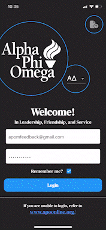
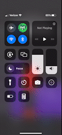
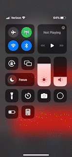
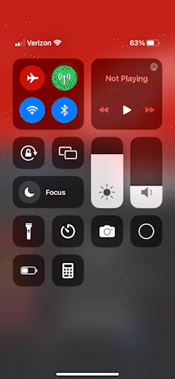

<em>An event registration iOS app to help members track requirements and events on-the-go, powered by Flutter.</em>

  
  
  
  

---

### iOS App Store - Download

---

### Demo

https://user-images.githubusercontent.com/60157725/218973376-82880a34-92e5-4c66-a439-af3e2eeffb74.mp4

---

### Goal

    This project's goal is to develop a mobile app capable of communicating with the webserver @ [http://www.apoonline.org](http://www.apoonline.org). Furthermore, it should be able to extract dynamic data in real-time and organize it into a comprehensive and interactive UI for iOS users.

## Features

| Demo                                                                                          | Use                                                                                                            |
| --------------------------------------------------------------------------------------------- | -------------------------------------------------------------------------------------------------------------- |
|                                | 1. Mobile access to view member requirements and upcoming events                                               |
|  | 2. Global day-view calendar sourced from [www.apoonline.org](https://www.apoonline.org) displaying open events |
|                           | 3. Event pages to view relevant info (location, date&time, host, description) with sign-up functionality       |
|           | 4. Google Calendar integration for easier schedule management                                                  |

## Tech Stack

* **Flutter** is used for the *frontend*, rendering pages such as `Login.dart`, `Home.dart`, `Calendar.dart`, `EventView.dart`, and `Settings.dart`.
  
  * > Flutter is an open source framework by Google for building beautiful, natively compiled, multi-platform applications from a single codebase.

* **Dart** is used for the *backend*, implementing a <u>modularized architecture</u> to store user & app data within Flutter's render tree.
  
  * Dart package [requests 4.7.0](https://pub.dev/packages/requests) for HTTP web scraping.

* The app's [user interface](https://drive.google.com/file/d/1KhqZ1vQyiHId7aefMGnJIE2o6Vi0O1Yr/view?usp=sharing) was designed using **Figma**. 

## Extensions

1. With direct integration to `www.apoonline.org`, this specific app's use cases <u>are limited</u>. But excluding this backend, the frontend is capable of efficiently tracking user data, properly re-rendering Dart widgets, and safe page navigation across the entire app.

2. The app currently only has functionality for Alpha Phi Omega's *Alpha Delta Chapter*. However, other chapters' integration can <u>easily be implemented</u> given `www.apoonline.org` allows chapter specification through URL query parameters. Feel free to message @anorderh if interested.

## Contributions

Pull requests are welcomed. For major changes, please open an issue first to discuss what you would like to change.

## License

[MIT License](LICENSE)
